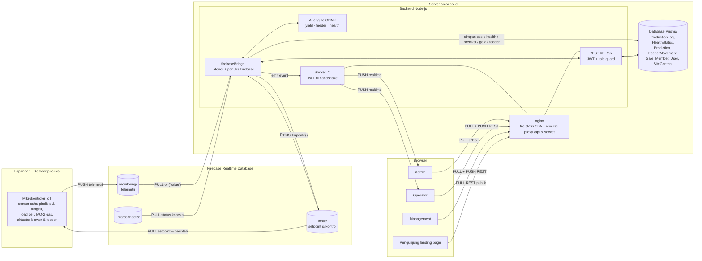
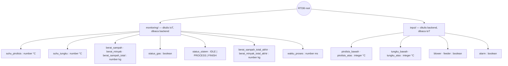
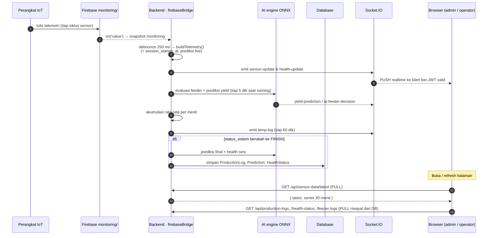
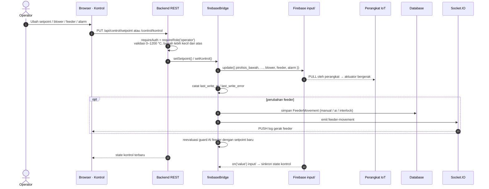
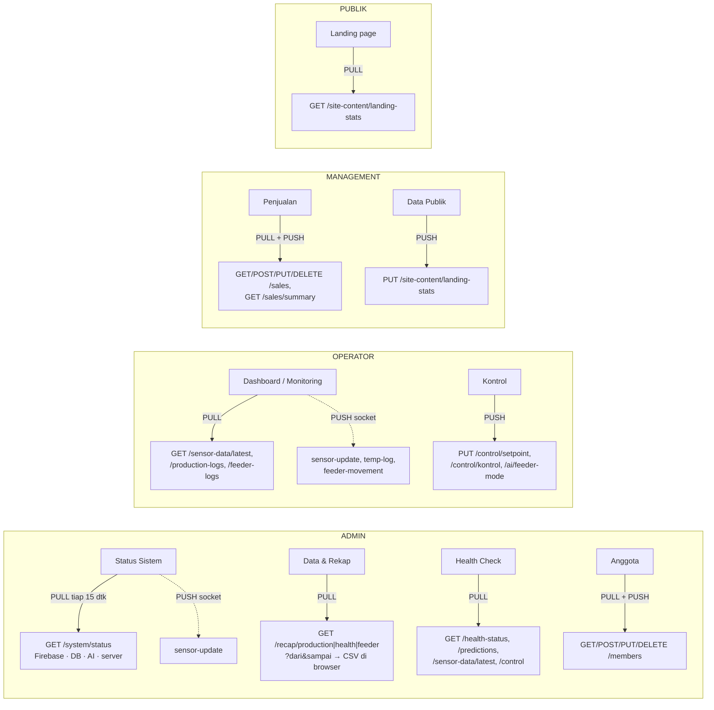
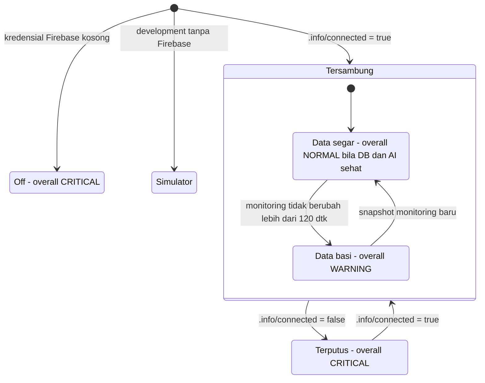

# AMOR — Arsitektur Pull & Push Data

Browser **tidak pernah** berbicara langsung dengan Firebase. Semua lalu lintas data melewati
backend (Express + Socket.IO) yang memegang kredensial Firebase Admin.

- **PULL** = data diambil / didengarkan dari sumbernya (IoT → Firebase → Backend → Browser).
- **PUSH** = data dikirim ke tujuan (Browser → Backend → Firebase → IoT, serta Backend → Browser via socket).

> Render: GitHub, VS Code (ekstensi Markdown Mermaid), atau https://mermaid.live

---

## 1. Arsitektur keseluruhan

## 2. Struktur node Firebase

## 3. PULL — telemetri IoT sampai ke layar

## 4. PUSH — perintah dari web sampai ke mesin

## 5. PULL & PUSH data aplikasi per role

## 6. Pemantauan koneksi Firebase (health check admin)

