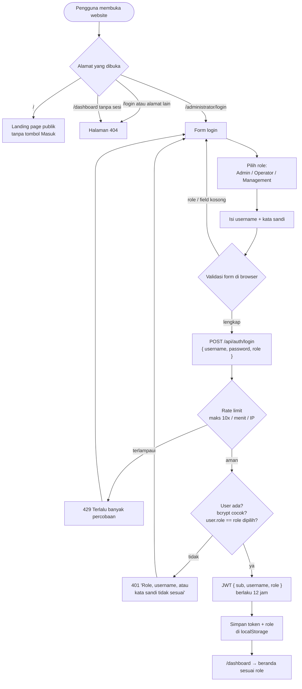
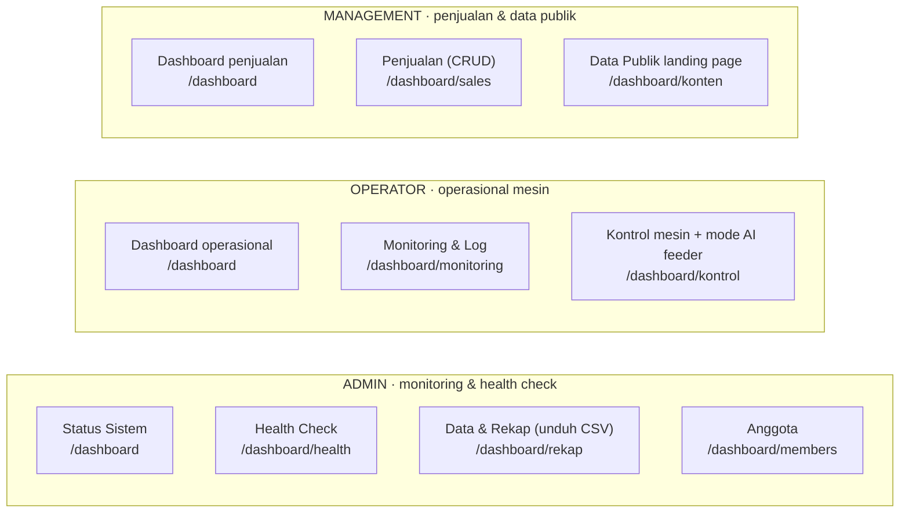
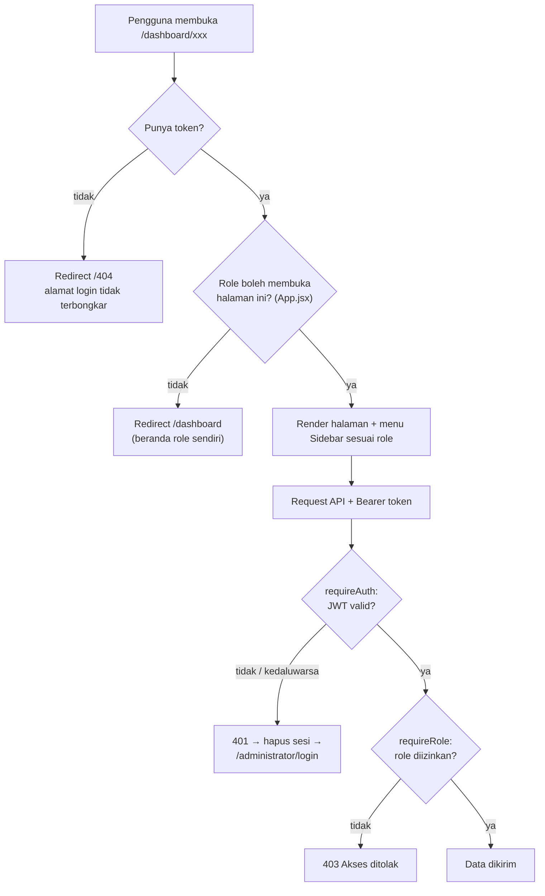
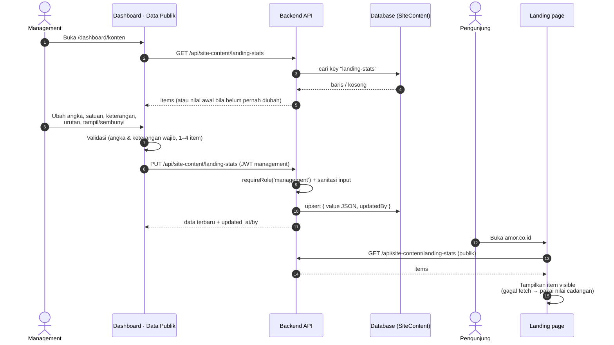
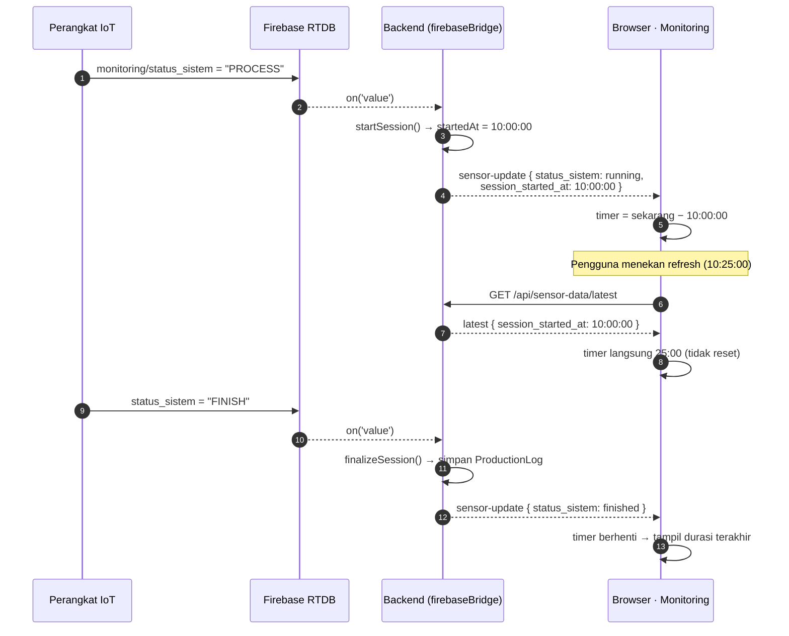
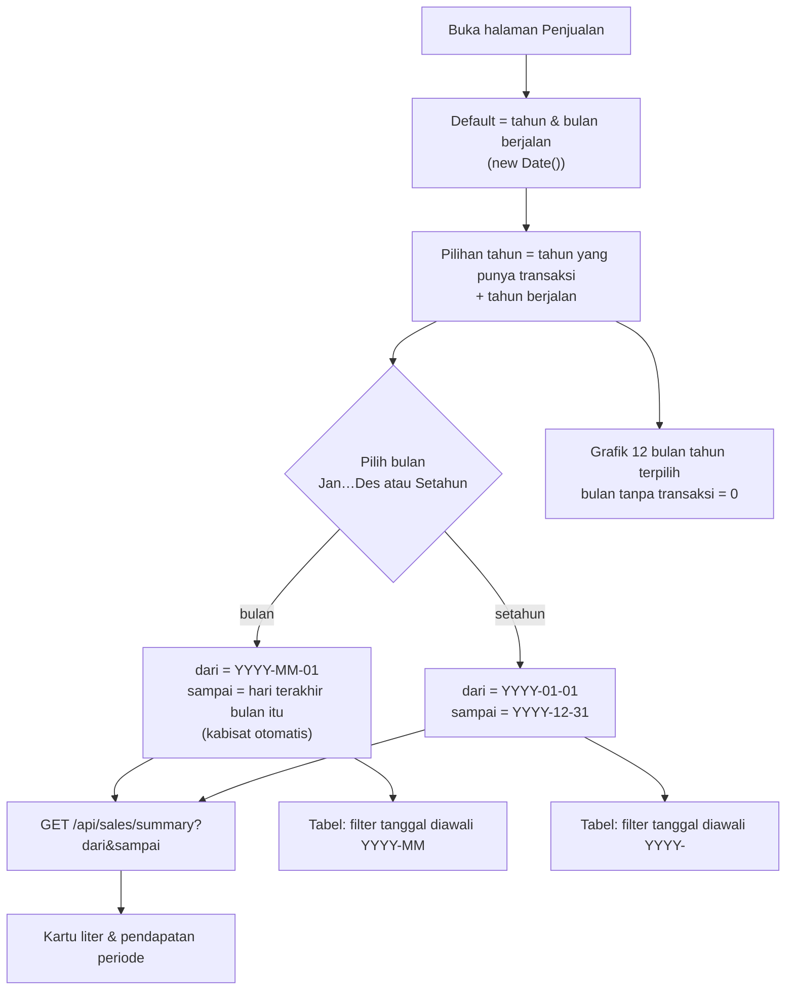

# AMOR — Diagram Logic Role, Login & Perbaikan Bug

Dokumen ini menggambarkan logic pembaruan: 3 role (admin, operator, management), login berbasis role
di alamat tersamar, pembagian section dashboard, edit data publik landing page, serta perbaikan
bug timer refresh dan bug keuangan yang mentok di April.

> Render: GitHub, VS Code (ekstensi Markdown Mermaid), atau https://mermaid.live

---

## 1. Alur login berbasis role (URL tersamar)

## 2. Pembagian section per role

## 3. Hak akses API per role (dikunci di backend)

| Endpoint | Admin | Operator | Management | Publik |
|---|:-:|:-:|:-:|:-:|
| `GET /sensor-data/latest`, `/production-logs`, `/health-status`, `/predictions`, `/feeder-logs`, `/control`, `/ai/status`, `/ai/monthly-health` | ✅ | ✅ | ❌ | ❌ |
| `POST /production-logs` | ✅ | ✅ | ❌ | ❌ |
| `PUT /control/setpoint`, `PUT /control/kontrol`, `PUT /ai/feeder-mode` | ❌ | ✅ | ❌ | ❌ |
| `GET /system/status`, `GET /recap/:jenis`, `* /members`, `POST /ai/warmup` | ✅ | ❌ | ❌ | ❌ |
| `* /sales`, `GET /sales/summary`, `PUT /site-content/:key` | ❌ | ❌ | ✅ | ❌ |
| `GET /site-content/:key` | ✅ | ✅ | ✅ | ✅ |
| `POST /auth/login` | ✅ | ✅ | ✅ | ✅ |

## 4. Penjaga akses (frontend + backend)

## 5. Edit data produksi di landing page (management)

## 6. Perbaikan bug timer proses yang reset saat refresh

**Sebelum:** timer dihitung dari jam browser saat halaman pertama kali melihat status `running`,
sehingga refresh = timer kembali `00:00`.
**Sesudah:** backend mencatat `startedAt` saat sesi mulai dan mengirim `session_started_at`
di setiap telemetri; browser menghitung `sekarang − session_started_at`.

## 7. Perbaikan bug keuangan yang mentok di April

**Sebelum:** pilihan periode ditulis mati (`April`, `Mei`, `Juni`, `Apr–Jun 2026`) dan kartu
"Bulan ini" dikunci ke Juni 2026, sehingga transaksi Juli dst. tidak pernah terlihat.
**Sesudah:** periode dihitung dari kalender.

